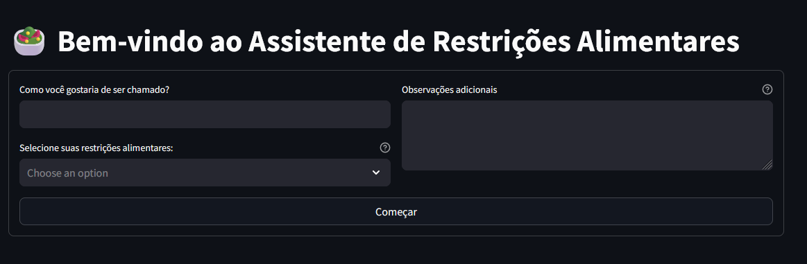
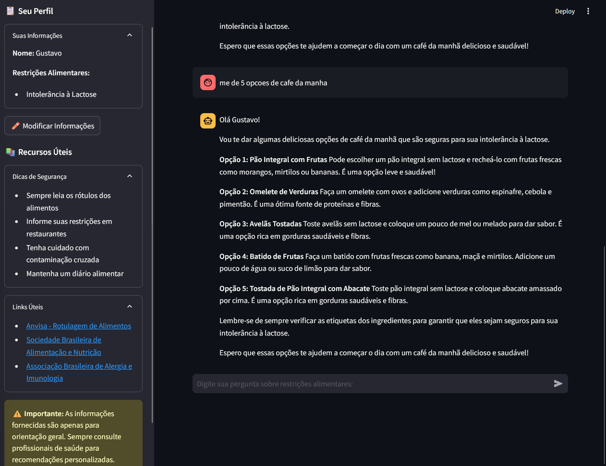

# 🥗 Assistente de Restrições Alimentares

## 🌟 Visão Geral
Bem-vindo ao projeto mais saboroso do GitHub! Este é um assistente inteligente desenvolvido com Streamlit que ajuda pessoas com restrições alimentares a navegarem pelo complexo mundo da alimentação de forma segura e personalizada.

### 📸 Telas do Sistema

#### Tela de Entrada


#### Interface de Chat


### 🎨 Interface Personalizada
- Onboarding amigável para coletar informações do usuário
- Chat interativo com IA para tirar dúvidas
- Perfil personalizado com suas restrições alimentares
- Interface responsiva e intuitiva

### 🤖 Assistente Inteligente
- Respostas personalizadas baseadas no seu perfil
- Sugestões de substituições de ingredientes
- Alertas sobre contaminação cruzada
- Dicas nutricionais personalizadas

### 📚 Recursos Educacionais
- Seção de dicas de segurança alimentar
- Links úteis para informações adicionais
- Recursos da ANVISA e outras organizações relevantes

## 🛠️ Tecnologias Utilizadas
- **Streamlit**: Para interface web interativa
- **LangChain**: Para integração com LLM
- **Ollama**: Modelo de linguagem para respostas inteligentes
- **Python Dataclasses**: Para estruturação de dados
- **Logging**: Para rastreamento de eventos

## 🚀 Como Começar

### Configurando o Ambiente de IA

#### 1. Instalação do Ollama
Primeiro, você precisa instalar o Ollama, que gerenciará o modelo de IA localmente:

**Linux e macOS**
```bash
curl -fsSL https://ollama.com/install.sh | sh
```

**Windows**
- Acesse [ollama.com/download](https://ollama.com/download)
- Baixe e execute o instalador Windows
- Siga as instruções de instalação

#### 2. Configuração do Modelo Llama
Após instalar o Ollama, configure o modelo Llama 3.1:

```bash
# Download do modelo
ollama pull llama3.1

# Verifique a instalação
ollama list
```

#### 3. Verificação do Serviço
```bash
# O serviço Ollama deve estar rodando em segundo plano
# Endereço padrão: localhost:11434

# Para verificar o status (Linux/macOS):
systemctl status ollama

# Para iniciar manualmente se necessário:
ollama serve
```

**Nota**: Mantenha o serviço Ollama rodando enquanto usar a aplicação.

### Instalação da Aplicação
1. Clone o repositório:
```bash
git clone [seu-repositorio]
cd assistente-restricoes-alimentares
```

2. Instale as dependências:
```bash
pip install -r requirements.txt
```

3. Execute o aplicativo:
```bash
streamlit run app.py
```

## 🎮 Como Usar

1. **Crie Seu Perfil**
   - Informe seu nome
   - Selecione suas restrições alimentares
   - Adicione observações especiais

2. **Interaja com o Assistente**
   - Faça perguntas sobre alimentos
   - Peça sugestões de substituições
   - Tire dúvidas sobre ingredientes

3. **Explore os Recursos**
   - Acesse dicas de segurança
   - Consulte links úteis
   - Mantenha-se informado

## 📝 Licença

Este projeto está sob a licença GNU GPL v3.0, que permite total liberdade para usar, estudar, modificar e distribuir o software e suas versões modificadas. A licença garante que essas liberdades sejam preservadas em versões modificadas do software.

## 🙏 Agradecimentos

- À comunidade Streamlit
- À equipe da Meta pelo excelente trabalho em tornar LLMs acessíveis localmente
